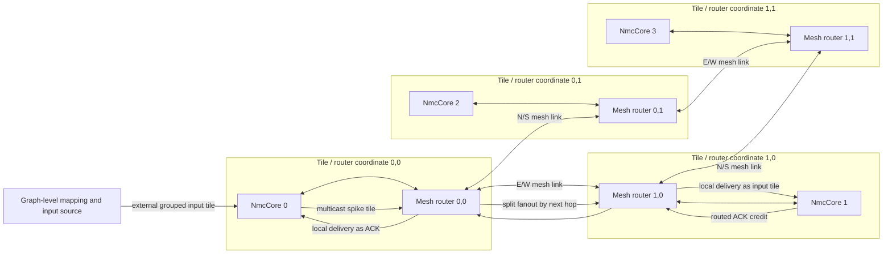
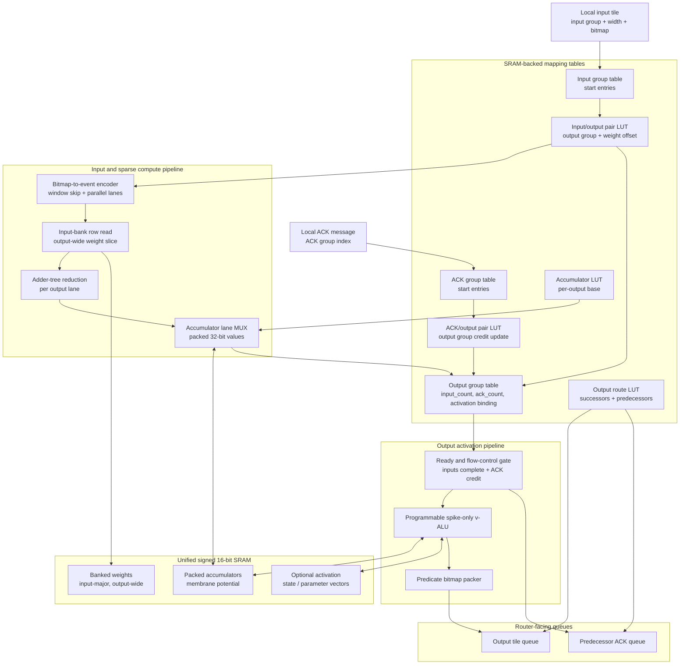
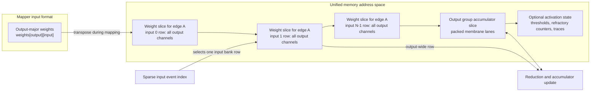
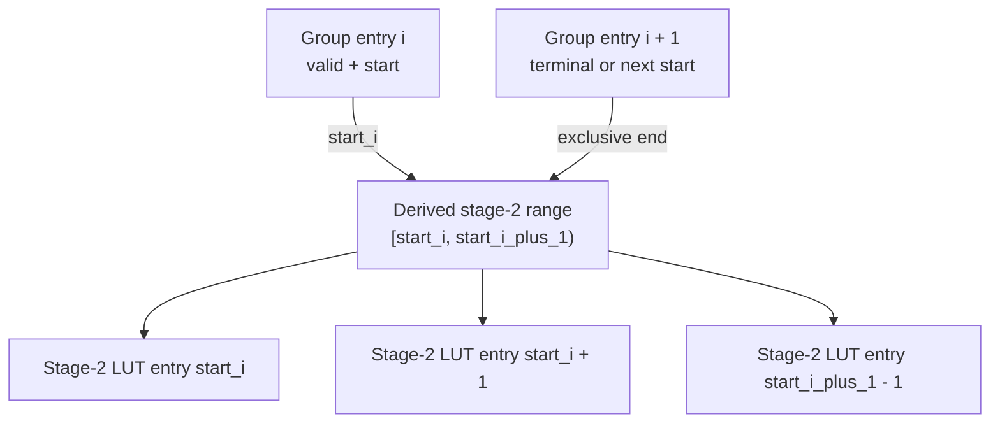
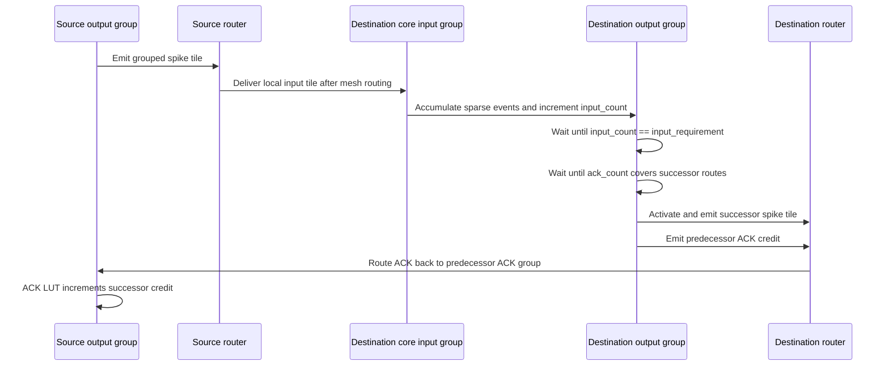

# Hardware Architecture Figures

This page summarizes the modeled hardware blocks in the simulator. The diagrams use Mermaid so they render directly in Markdown viewers that support Mermaid, including GitHub and VS Code Markdown preview.

## System-level tile and mesh organization

Each accelerator core is paired with an independent mesh router. Cores emit grouped spike tiles and ACK messages into the local router. The router performs dimension-order routing and splits multicast traffic by next-hop port.

## Single-core datapath

The core datapath is event-driven. An incoming bitmap selects a local input group. The input LUT expands the group into one or more output-group fanout entries, the encoder extracts sparse events, and each event selects an output-wide row from unified memory. Accumulation, activation, routing metadata lookup, output emission, and predecessor ACK generation are all controlled by hardware-like tables.

## Unified-memory layout

The simulator models one unified signed 16-bit memory space. Weight matrices are transposed from caller-facing output-major form into input-bank-major, output-wide rows. Accumulators use packed lanes, so one logical membrane value occupies `NMC_ACCUMULATOR_LANES` adjacent 16-bit words. Optional per-neuron activation state or parameters are allocated only when a program requires them.

## LUT range generation pattern

Most table lookups use start-plus-terminal indirection. A group entry stores only the inclusive start address. The exclusive end address comes from the next group entry, including the terminal sentinel at index `group_count`.

This structure is used by input-to-output fanout tables, ACK-to-output credit tables, and output route metadata. It mirrors simple hardware address generation and avoids dynamic per-group allocation metadata.

## Natural-step flow control

Output activation is gated by both input readiness and successor ACK credit. Feed-forward outputs emit predecessor ACKs after activation succeeds. Recurrent predecessor ACKs can be emitted when an input window completes so cyclic graphs do not deadlock while still preserving one-tile ordering.

